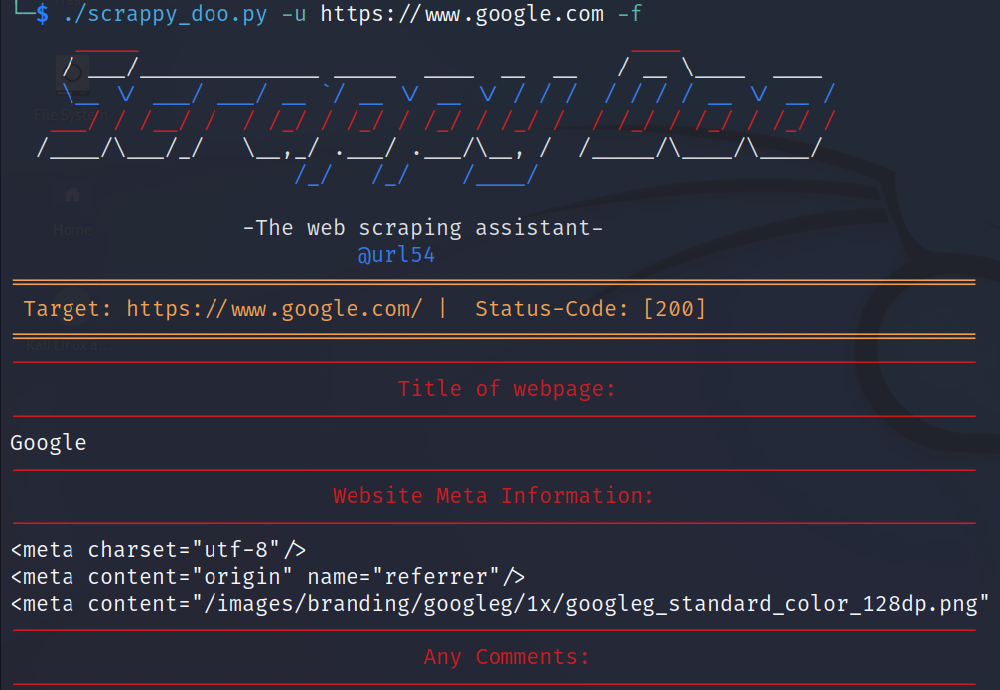

# About Scrappy-Doo
Scrappy-doo, scrapes the juicy goodness from websites. Providing a full-url, Scrappy-doo will print off the the following items from the website's page:
- The website title.
- Website Meta Information.
- Any comments in the page.
- Any hidden form fields in the page.
- All anchor tag hrefs.
- All script tag srcs.
- And all webpage strings.

# Screenshot


# Installation
```bash
git clone https://github.com/url54/scrappy-doo.git
```

# Recommend Python Version
Scrappy-doo was written in Python 3.10.5. This is the only version that it has been tested with, however, most of the requirements are pretty generic, and should work with other versions of Python. 

# Dependencies
Srappy-doo was written with Requests, Re, Argparse, BeautifulSoup, pathlib, and colorama. This dependencies can be installed using the requirements.txt file.

- Installation on Linux:
```bash
sudo pip install -r requirements.txt
```

# Usage
Short | Long | Description
------|------|------------
-h | --help | Display help and list of switches. 
-u | --url | Provide full url for the target.
-f | --full | Full target scrape.
-a | --anchor | Scrape the hrefs from the anchor tags.
-m | --meta | Scrape the meta tags from the target.
-c | --comment | Scrape the comments from the target.
-s | --source | Scrape the sources from script tags.
-S | --string | Scrape the strings from the target.
-H | --hidden | Scrape hidden form fields.

# Examples
- Full list example
```bash
./scrappy_doo.py -u https://www.google.com -f
```

- Scrape only anchors
```bash
./scrappy_doo.py -u https://www.google.com -a
```

- Scrape only meta tags
```bash
./scrappy_doo.py -u https://www.google.com -m
```

- Scrape a variety of items
```bash
./scrappy_doo.py -u https://www.google.com -a -s -S -c -H
```

- Scrape a variety of items one-switch style
```bash
./scrappy_doo.py -u https://www.google.com -asScH
```


